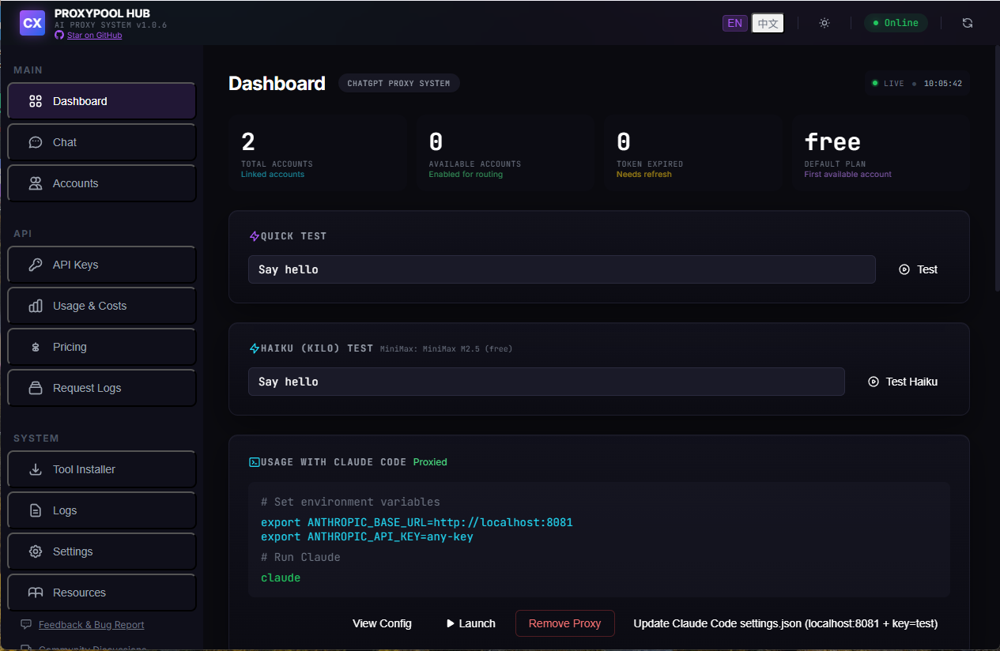
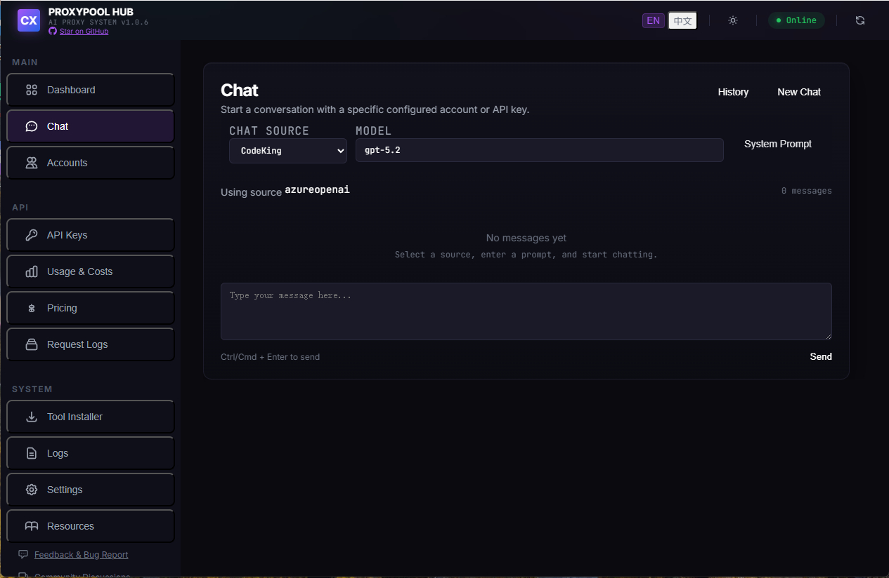
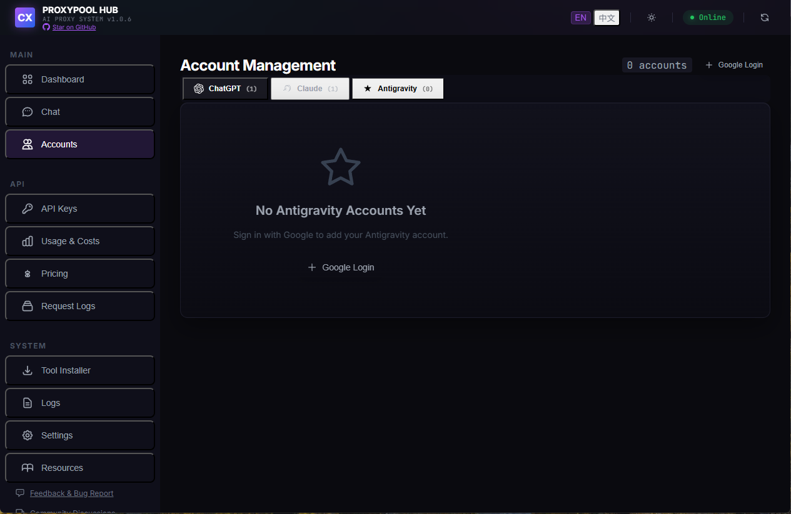
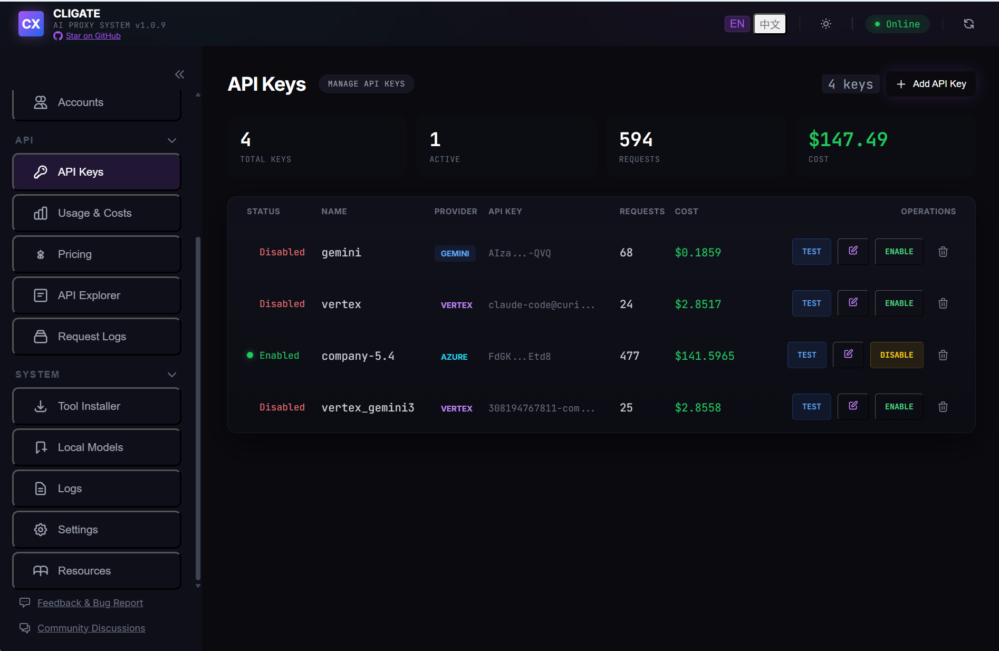
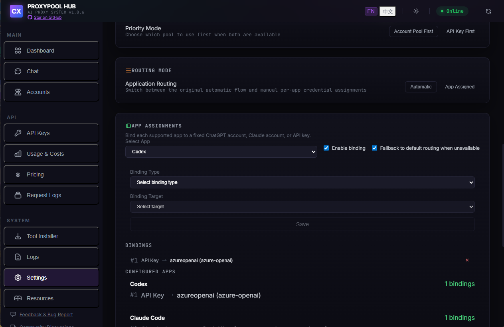
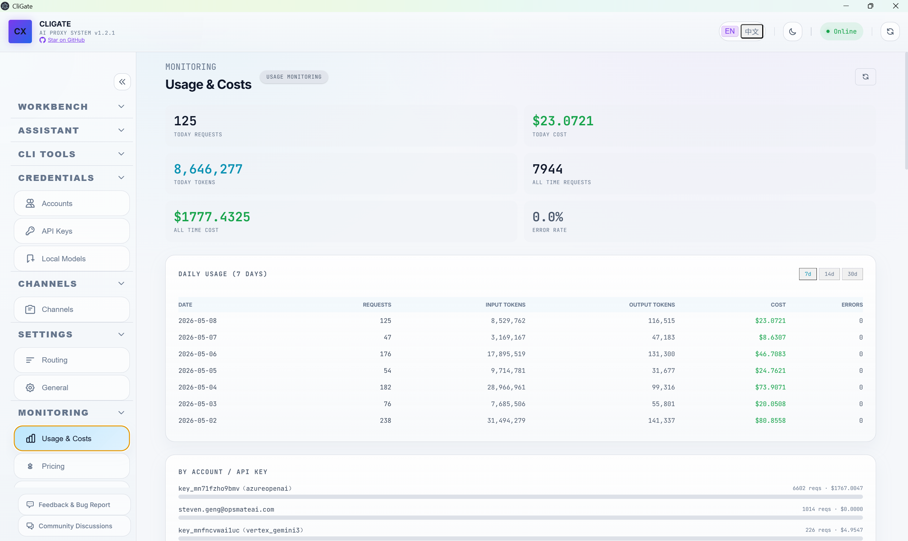
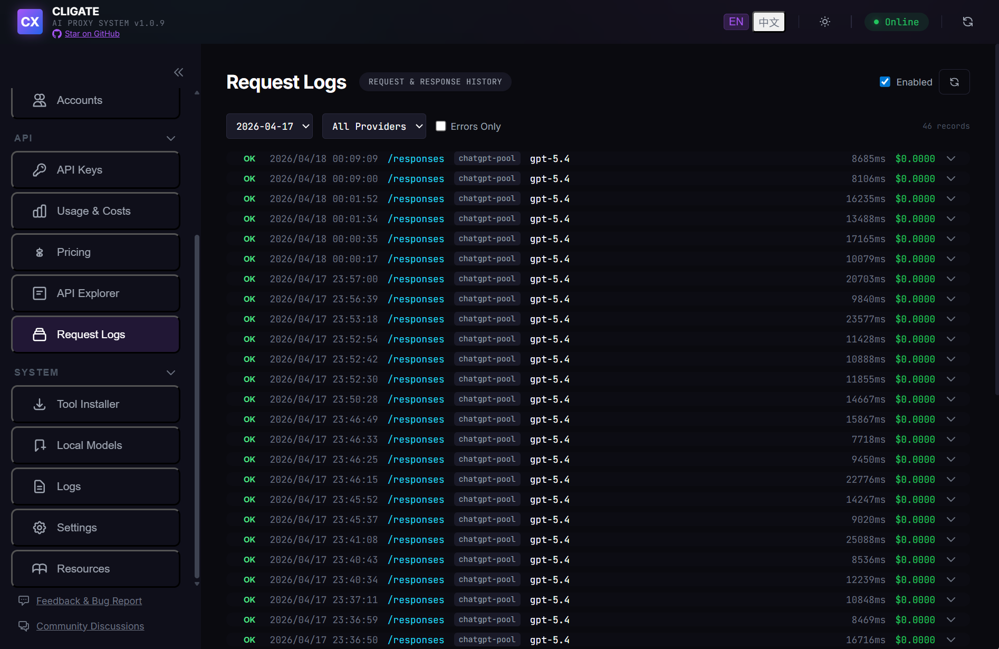
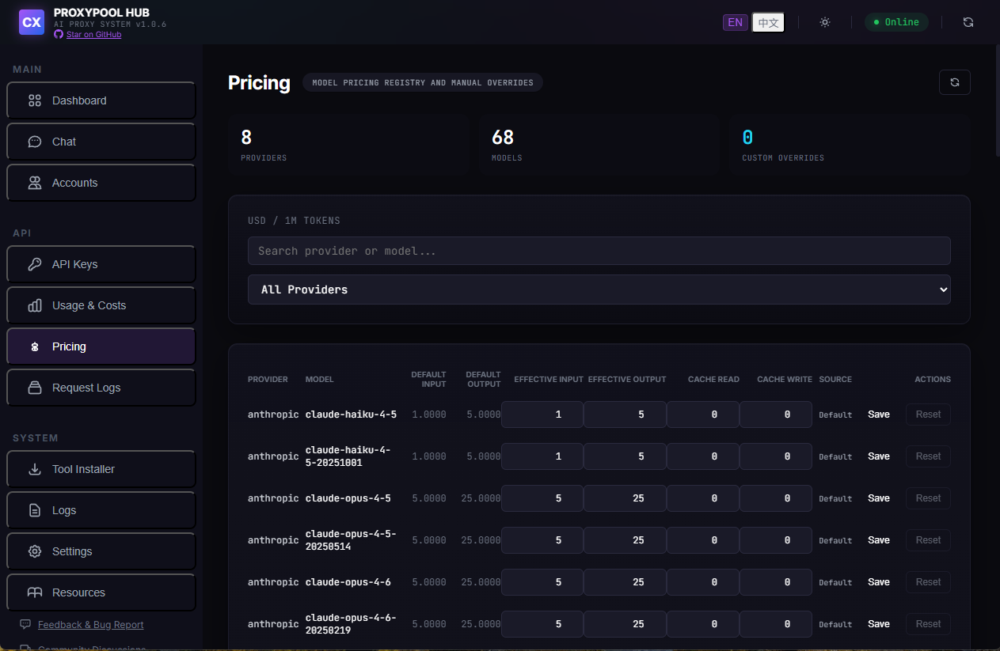
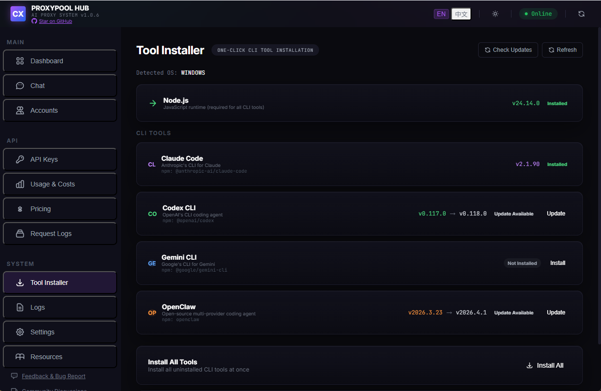
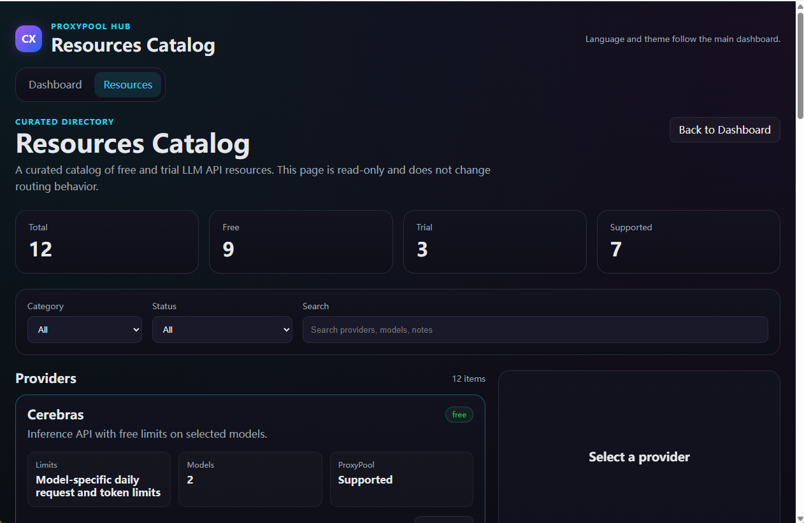

# ProxyPool Hub



[](https://www.gnu.org/licenses/agpl-3.0)
[](https://nodejs.org/)
[](https://www.npmjs.com/package/proxypool-hub)
[](https://github.com/yiyao-ai/proxypool-hub)

**[English](./README.md) | 中文**

> 多协议 AI API 代理服务器，支持账户池、API Key 管理和可视化仪表盘。
> 通过统一的本地代理使用 **Claude Code**、**Codex CLI**、**Gemini CLI** 和 **OpenClaw** —— 支持多账户轮换、智能路由、免费模型路由、用量统计和一键配置。

---

## 功能特性

### 多 CLI 代理支持
- **Claude Code** — 代理 Anthropic Messages API (`/v1/messages`)，支持流式响应
- **Codex CLI** — 代理 OpenAI Responses API (`/v1/responses`)、Chat Completions (`/v1/chat/completions`) 和 Codex 内部 API (`/backend-api/codex/responses`)
- **Gemini CLI** — 代理 Gemini API (`/v1beta/models/*`)，一键 patch
- **OpenClaw** — 自定义 provider 注入，支持 `anthropic-messages` 和 `openai-completions` 协议

### 账户与密钥管理
- **ChatGPT 账户池** — OAuth 登录、多账户轮换（固定/轮询/随机）、自动 token 刷新、按账户用量配额追踪
- **Claude 账户池** — OAuth PKCE 登录、token 刷新后自动回写至 Claude Code 凭证文件
- **Antigravity 账户池** — Google OAuth 登录，支持企业模型、自动模型发现和项目管理
- **API Key 池** — 支持 OpenAI、Azure OpenAI、Anthropic、Google Gemini、Vertex AI、MiniMax、Moonshot、ZhipuAI 密钥，自动故障转移与负载均衡
- **密钥验证** — 一键测试每个 API Key 的连通性
- **智能 Token 刷新** — 仅在 token 即将过期时（< 5 分钟）才刷新，刷新后同步回源 CLI 工具

### 智能路由
- **优先级模式** — 在两者都可用时，选择"账户池优先"或"API Key 优先"
- **路由模式** — 自动路由或手动按应用绑定凭证
- **应用路由** — 将每个应用（Claude Code、Codex、Gemini CLI、OpenClaw）绑定到指定的 ChatGPT 账户、Claude 账户或 API Key
- **模型映射** — 自定义每个 provider 解析到哪个上游模型
- **免费模型路由** — 将 `claude-haiku` 请求路由到免费模型（DeepSeek、Qwen、MiniMax 等），通过 Kilo AI 网关，无需 API Key

### 分析与监控
- **用量与成本** — 按账户、按模型、按 provider 的使用量和成本统计，支持按日/按月分析
- **请求日志** — 完整的请求/响应日志，支持按日期和 provider 筛选，可仅查看错误
- **实时日志流** — SSE 实时日志流，便于调试
- **定价管理** — 查看和自定义按 provider、按模型的定价，支持手动覆盖

### Web 仪表盘
- **仪表盘** — 快速状态指标（总账户/可用账户数、过期 token、默认计划）、快速测试按钮、Claude Code 使用示例
- **Chat 聊天** — 交互式聊天界面，支持选择数据源（ChatGPT、Claude、API Key）、模型选择、系统提示词和聊天记录
- **账户管理** — 选项卡式界面，管理 ChatGPT、Claude 和 Antigravity 账户，支持添加/删除/启用/禁用/切换
- **API Key 管理** — 添加、测试、编辑、禁用 API Key，支持 provider 专属字段（Azure 部署名称/API 版本、Vertex 项目 ID/区域）
- **工具安装器** — 检测并安装/更新 Node.js、Claude Code、Codex CLI、Gemini CLI、OpenClaw —— 自动识别操作系统，显示版本状态，检查更新
- **资源目录** — 精选的免费和试用 LLM API 资源目录，含 provider 详情、限制和兼容性信息
- **一键 CLI 配置** — 一个按钮配置 Claude Code、Codex CLI、Gemini CLI、OpenClaw
- **国际化** — 中英文界面
- **深色/浅色主题** — 切换深色和浅色模式

---

## 界面预览

| 仪表盘 | Chat 聊天 |
|:-:|:-:|
|  |  |

| 账户管理 | API Key 管理 |
|:-:|:-:|
|  |  |

| 设置与应用路由 | 用量与成本 |
|:-:|:-:|
|  |  |

| 请求日志 | 定价管理 |
|:-:|:-:|
|  |  |

| 工具安装器 | 资源目录 |
|:-:|:-:|
|  |  |

### 操作演示


---

## 架构

```
┌─────────────┐  ┌───────────┐  ┌────────────┐  ┌──────────┐
│ Claude Code │  │ Codex CLI │  │ Gemini CLI │  │ OpenClaw │
└──────┬──────┘  └─────┬─────┘  └──────┬─────┘  └────┬─────┘
       │               │               │              │
       └───────────────┼───────────────┼──────────────┘
                       ▼
            ┌─────────────────────┐
            │   ProxyPool Hub     │
            │   localhost:8081    │
            │                     │
            │  ┌───────────────┐  │
            │  │  协议翻译层    │  │
            │  └───────┬───────┘  │
            │          │          │
            │  ┌───────▼───────┐  │
            │  │ 账户池 &      │  │
            │  │ 密钥路由器    │  │
            │  └───────┬───────┘  │
            └──────────┼──────────┘
                       │
       ┌───────┬───────┼───────┬───────┐
       ▼       ▼       ▼       ▼       ▼
┌────────┐┌────────┐┌────────┐┌────────┐┌────────┐
│Anthropic││ OpenAI ││Google  ││Vertex  ││Kilo AI │
│  API   ││  API   ││Gemini  ││  AI    ││ (免费)  │
└────────┘└────────┘└────────┘└────────┘└────────┘
```

---

## 快速开始

### 方式 1：npx 直接运行（无需安装）

```bash
npx proxypool-hub@latest start
```

### 方式 2：全局安装

```bash
npm install -g proxypool-hub
proxypool-hub start
```

### 方式 3：桌面应用（Electron）

从 [Releases](https://github.com/yiyao-ai/proxypool-hub/releases) 下载最新安装包。

---

## 配置说明

### 1. 启动服务

```bash
proxypool-hub start
```

仪表盘地址：**http://localhost:8081**

### 2. 添加账户或 API Key

**Web 仪表盘**（推荐）：
1. 打开 http://localhost:8081 → **账户管理** 标签
2. 点击 **添加账户** → 使用 ChatGPT / Claude / Google（Antigravity）账号登录
3. 或前往 **API Keys** 标签 → **添加 API Key**，填入 OpenAI、Azure、Gemini、Vertex AI 或其他 provider 密钥
4. 账户自动保存，token 自动刷新

**命令行**：
```bash
proxypool-hub accounts add              # 打开浏览器登录
proxypool-hub accounts add --no-browser  # 无浏览器环境（VM/服务器）
```

### 3. 配置 CLI 工具

在仪表盘或设置页面点击**一键配置**按钮，或手动配置：

**Claude Code：**
```bash
export ANTHROPIC_BASE_URL=http://localhost:8081
export ANTHROPIC_API_KEY=any-key
claude
```

**Codex CLI：**
```toml
# ~/.codex/config.toml
chatgpt_base_url = "http://localhost:8081/backend-api/"
openai_base_url = "http://localhost:8081"
```

**Gemini CLI：** 使用仪表盘中的一键 patch 按钮。

**OpenClaw：** 使用一键配置按钮，或手动添加到 `~/.openclaw/openclaw.json`：
```json
{
  "models": {
    "providers": {
      "proxypool": {
        "baseUrl": "http://localhost:8081",
        "apiKey": "sk-ant-proxy",
        "api": "anthropic-messages"
      }
    }
  }
}
```

### 4. 配置路由（可选）

在 **设置** 页面：
- **优先级模式** — 选择"账户池优先"或"API Key 优先"
- **路由模式** — "自动"为智能路由，"应用绑定"为按应用指定凭证
- **应用绑定** — 将 Claude Code、Codex、Gemini CLI 或 OpenClaw 绑定到指定账户或 API Key

---

## 模型映射

| 请求模型 | 路由至 | 需要认证 |
|:---|:---|:---:|
| `claude-sonnet-4-6` | GPT-5.2 Codex / Anthropic API | 是 |
| `claude-opus-4-6` | GPT-5.3 Codex / Anthropic API | 是 |
| `claude-haiku-4-5` | Kilo AI 免费模型 | 否 |

可在设置页面将 haiku 模型切换为任意免费模型（DeepSeek R1、Qwen3、MiniMax 等）。

---

## API 端点

| 端点 | 协议 | 使用者 |
|:---|:---|:---|
| `POST /v1/messages` | Anthropic Messages | Claude Code、OpenClaw |
| `POST /v1/chat/completions` | OpenAI Chat Completions | Codex CLI、OpenClaw |
| `POST /v1/responses` | OpenAI Responses | Codex CLI |
| `POST /backend-api/codex/responses` | Codex 内部协议 | Codex CLI |
| `POST /v1beta/models/*` | Gemini API | Gemini CLI |
| `GET /v1/models` | OpenAI Models | 通用 |
| `GET /health` | 健康检查 | 监控 |

完整 API 文档见 [API Documentation](./docs/API.md)。

---

## 安全与隐私

- **100% 本地运行** — 完全在 `localhost` 运行，不涉及任何外部服务器
- **直连官方 API** — 直接连接 OpenAI、Anthropic、Google 官方 API，无第三方中转
- **零遥测** — 不收集任何数据，不追踪任何信息
- **Token 安全** — 凭证以 `0600` 权限存储在本地，智能刷新避免不必要的 token 轮换
- **源凭证回写** — 导入的账户 token 刷新后，自动同步回源 CLI 工具的凭证文件，确保 CLI 正常使用

---

## 社区

- [GitHub Discussions](https://github.com/yiyao-ai/proxypool-hub/discussions) — 提问、交流、反馈
- [Discord](https://discord.gg/GgxZSehxqG) — 实时聊天
- **微信** — 扫码添加作者微信，备注「ProxyPool Hub」拉你进群

  

---

## 支持项目

如果这个项目对你有帮助，欢迎赞助支持：

[](https://afdian.com/a/yiyaoai)

---

## 许可证

本项目基于 [AGPL-3.0](https://www.gnu.org/licenses/agpl-3.0) 许可证开源。

## 免责声明

本项目是独立的开源工具，与 Anthropic、OpenAI、Google 没有任何关联、背书或赞助关系。所有商标均属于其各自所有者。请负责任地使用，并遵守相关服务条款。

---

<div align="center">
  <sub>为同时使用多种 AI 编程助手的开发者而构建。</sub>
  <br>
  <a href="https://github.com/yiyao-ai/proxypool-hub">
    
  </a>
</div>
