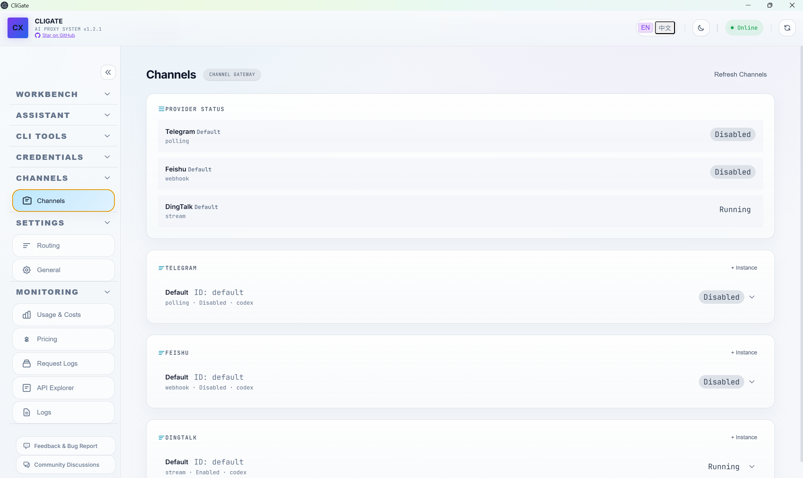

# CliGate


[](https://www.gnu.org/licenses/agpl-3.0)
[](https://nodejs.org/)
[](https://www.npmjs.com/package/cligate)
[](https://github.com/codeking-ai/cligate)

**[English](./README.md) | 中文**

CliGate 是一个本地 AI 控制平面，重点围绕两大能力：

- **Assistant**：一个常驻后端的私人助手 / 私人管家，能理解用户任务、记住上下文、使用工具、安排定时工作、接入渠道，并通过 MCP、Skills、桌面自动化、Shell / 文件工具或委派运行时自己执行事情。
- **Model Proxy**：为 Claude Code、Codex CLI、Gemini CLI、OpenClaw 以及 API 兼容客户端提供统一本地 API 和模型路由层，集中管理账户、API Key、模型映射、日志、用量和成本。

这两层都默认运行在 `localhost`：Assistant 像个人任务执行者一样长期驻守；Model Proxy 负责 provider 接入、路由、凭证、统一模型名和可观测性。

## 为什么是 CliGate

- 一个本地仪表盘同时承接私人助手和统一模型路由
- Assistant 任务支持记忆、审批、追问、定时工作、渠道接入和工具执行
- 账户池、API Key、本地运行时、应用路由和模型映射集中在同一代理层
- Telegram、飞书、钉钉渠道可以接入运行时工作流
- 默认本地部署，无需托管中转服务

## 当前能力

### Assistant

- Dashboard Chat 与 Assistant Tasks，用于个人任务执行
- 常驻 Assistant Agent，支持任务记录、记忆、策略、审批和可恢复执行
- 通过 Skills、MCP、Shell / 文件工具、定时任务、渠道和可选桌面自动化执行动作
- 在任务需要外部编程代理时，可选择委派给 Codex / Claude Code runtime session
- Telegram、飞书、钉钉渠道工作流

### Model Proxy

- Anthropic Messages、OpenAI Chat Completions、OpenAI Responses、Codex、Gemini 兼容端点
- Claude Code、Codex CLI、Gemini CLI、OpenClaw 的一键配置
- ChatGPT、Claude、Antigravity 账户池
- OpenAI、Azure OpenAI、Anthropic、Gemini、Vertex AI、MiniMax、Moonshot、ZhipuAI、DeepSeek、通义千问、OpenRouter 等 API Key 池
- 路由优先级、按应用绑定、模型映射、免费模型路由
- 可选本地模型路由，例如 Ollama

### 观测与运维

- 用量统计和定价
- 请求日志和实时日志流
- API Explorer
- 工具安装器和 CLI 配置助手
- 免费 / 试用模型资源目录

## 快速开始

### 1. 启动 CliGate

```bash
npx cligate@latest start
```

或者全局安装：

```bash
npm install -g cligate
cligate start
```

或者使用桌面端 release 包：

1. 从 [Releases](https://github.com/codeking-ai/cligate/releases) 下载适合你平台的安装包或应用包。
2. 安装或直接打开后，启动 `CliGate`。
3. CliGate 会自动启动本地服务，并直接打开桌面窗口。

默认仪表盘地址：

`http://localhost:8081`

### 2. 至少添加一个可用凭证

在仪表盘中使用：

- `Accounts` 添加 ChatGPT / Claude / Antigravity
- `API Keys` 添加各类 provider key
- `Local Models` 配置本地运行时

### 3. 选择第一条路径

如果要使用 Assistant，打开 `Chat` 或 `Assistant Tasks`，直接告诉私人助手你想完成什么。

如果要使用 Model Proxy，让 CLI 工具或 API 兼容客户端接入 CliGate。

Claude Code：

```bash
export ANTHROPIC_BASE_URL=http://localhost:8081
export ANTHROPIC_API_KEY=any-key
claude
```

Codex CLI：

```toml
# ~/.codex/config.toml
chatgpt_base_url = "http://localhost:8081/backend-api/"
openai_base_url = "http://localhost:8081"
```

Gemini CLI 和 OpenClaw 也可以直接在仪表盘完成配置。

## 用户入口

### Assistant 用户

通过 `Chat`、`Assistant Tasks`、`Conversation Records`、`Scheduled`、`Skills`、`MCP` 和渠道，让常驻助手执行真实任务、记住上下文、使用工具、发送追问并在后台持续工作。

### Model Proxy 用户

启动服务，添加一个凭证，执行一键配置，然后从 Claude Code、Codex CLI、Gemini CLI、OpenClaw 或 API 兼容客户端发出第一条代理请求。

### 仪表盘运维用户

通过仪表盘管理账户、API Key、路由优先级、模型映射、本地运行时、定价、请求日志、用量、渠道设置、Skills、MCP 和桌面代理设置。

## 界面预览

| 仪表盘 | Chat |
|:--|:--|
|  |  |

| 路由与设置 | 渠道管理 |
|:--|:--|
|  |  |

| 用量与成本 |
|:--|
|  |

## 文档导航

如果你想快速找到正确的说明，建议从这里开始：

- [文档中心](./docs/README.md)
- [产品使用说明书（英文）](./docs/product-manual.en.md)
- [产品使用说明书（中文）](./docs/product-manual.zh-CN.md)
- [架构说明](./docs/ARCHITECTURE.md)
- [API 文档](./docs/API.md)
- [应用路由](./docs/APP_ROUTING.md)
- [账户说明](./docs/ACCOUNTS.md)
- [OpenClaw 集成](./docs/OPENCLAW.md)
- [截图维护规范](./docs/SCREENSHOTS.md)
- [发布说明](./docs/RELEASING.md)
- [社区与联系方式](./docs/COMMUNITY.md)
- [贡献指南](./CONTRIBUTING.md)
- [安全策略](./SECURITY.md)
- [支持与反馈](./SUPPORT.md)
- [更新记录](./CHANGELOG.md)

服务启动后，还可以直接在本地打开轻量说明页：

- `http://localhost:8081/manual/`
- `http://localhost:8081/resources/`

## 本地架构

```text
Assistant 入口
  Web Chat / Assistant Tasks / Telegram / 飞书 / 钉钉 / 定时任务
           |
           v
私人助手与工具
  Memory / Policies / Skills / MCP / Desktop Agent / Shell + File Tools / 可选 Codex + Claude Code 委派
           |
           v
CliGate 本地控制平面 (localhost:8081)
           |
           +--> Model Proxy
           |    - 协议转换
           |    - 账户与 API Key 路由
           |    - 应用绑定与模型映射
           |    - 本地模型路由
           |
           v
上游 Provider 与本地运行时
  OpenAI / Anthropic / Gemini / Vertex AI / Kilo / Ollama / others
```

## 核心接口

| 端点 | 用途 |
|:--|:--|
| `POST /v1/messages` | Anthropic Messages 代理 |
| `POST /v1/chat/completions` | OpenAI Chat Completions 代理 |
| `POST /v1/responses` | OpenAI Responses 代理 |
| `POST /backend-api/codex/responses` | Codex 内部兼容接口 |
| `POST /v1beta/models/*` | Gemini CLI 代理 |
| `GET /api/agent-runtimes/providers` | Runtime provider 列表 |
| `GET /api/agent-channels/conversations` | 渠道会话记录 |
| `GET /api/assistant/tasks` | Assistant 任务记录 |
| `GET /api/assistant/mcp/servers` | MCP server 管理 |
| `GET /api/assistant/skills` | Assistant Skills 管理 |
| `GET /api/desktop-agent/status` | Desktop Agent 状态 |
| `GET /api/local-runtimes` | 本地运行时状态 |
| `GET /api/resources` | 资源目录 |
| `GET /health` | 健康检查和版本 |

更完整内容见 [docs/API.md](./docs/API.md)。

## 社区

- [GitHub Discussions](https://github.com/codeking-ai/cligate/discussions)
- [Issues](https://github.com/codeking-ai/cligate/issues)
- [Discord](https://discord.gg/GgxZSehxqG)
- [X](https://x.com/GengSteven58767)
- [社区与联系方式](./docs/COMMUNITY.md)
- [Releases](https://github.com/codeking-ai/cligate/releases)

如需直接联系作者，可直接扫码添加个人微信：


添加时建议备注 `CliGate`，便于识别。

如果你准备提 PR，请先看 [CONTRIBUTING.md](./CONTRIBUTING.md)。

## 许可证

本项目基于 [AGPL-3.0](https://www.gnu.org/licenses/agpl-3.0) 开源。

## 免责声明

CliGate 是独立的开源项目，与 Anthropic、OpenAI、Google 及其他上游 provider 没有隶属关系。
